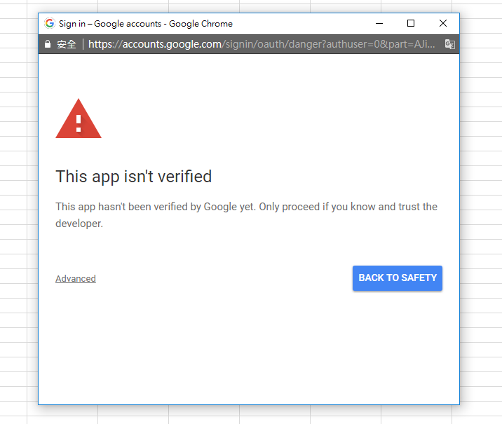

# Weaponizing-Google-App-Scripts
A walkthrough and guide to weaponizing Google App Scripts post exploitation and compromise of a google workspace account. Same code snippits will be provided along with general guide on how to conduct these techniques. 

## App Scripts
Google App Scripts can be utilized to execute any action a typical user may do with their workspace account such as send an email, create a calendar event, or add a user to a group (there endless examples). Google Workspace users can create App Scripts and set them as a standalone project or bound them to Google Docs/Sheets/Slides/Forms. An App Script is code that will be triggered when a user with editor permission access the doc (and after accepting the OAuth prompt). The first issue arrises when a user is given access to a doc that uses an unverified project. It presents a large warning banner stating the project is not verified. The banner when authorizing the OAuth prompt will look similar to the following:

However, even if the app isn't verified there are a couple of ways to bypass the banner:
- Enusure the publisher of the app is in the same Workspace as the target accessing it
- The script is in a drive of the target

### Copy Document Unverified Prompt Bypass

When you create a link to share a document a link similar to this one is created: https://docs.google.com/spreadsheets/d/1i5[...]aIUD/edit
If you change the ending of the URI from "/edit" to "/copy", google will ask you if you want to generate a copy of the document.

If someone creates a copy of that document that contained the App Script, the user will also be copying the App Script(s), therefore when the user opens the copied spreadsheet, the regular OAuth prompt will appear bypassing the unverified prompt, because the user is now the author of the App Script of the copied file.

### Shared Document Unverified Prompt Bypass

Moreover, if someone shared with you a document with editor access, you can generate App Scripts inside the document and the OWNER (creator) of the document will be the owner of the App Script.

This means, that the creator of the document will appear as creator of any App Script anyone with editor access creates inside of it.

This also means that the App Script will be trusted by the Workspace environment of the creator of the document.

This also means that if an App Script already existed and people have granted access, anyone with Editor permission on the doc can modify it and abuse that access.
To abuse this you also need people to trigger the App Script. And one neat trick if to publish the script as a web app. When the people that already granted access to the App Script access the web page, they will trigger the App Script (this also works using \ tags).

## App Scripts for Post Exploitation

Depending on if you use REST APIs or just google apps script APIs, you may need to create a google cloud platform (GCP) project with the user that was compromised. Google Apps Script APIs will work without having to create a GCP Project. The REST APIs will need to be associated with a project that has those APIs added to them. To create a GCP Project and link it to your Apps Script you can perform the following steps:

1. Sign in to http://console.cloud.google.com/

2. From the hamburger menu on the left, select APIs & Services -> Credentials

3. Click "Create Project"

4. Name the project whatever name you want, select your domain for the "Organization." Location" should auto fill when you select the org.

5. Click "Create"

6. Click "CREATE CREDENTIALS"

7. Click "CONFIGURE CONSENT SCREEN"

8. Select "Internal" for "User Type"

9. Click "Create"

10. On the left hand side of the screen, click "OAuth Consent Screen"

11. Click "Edit App" towards the top of the screen

12. Fill in whatever for "App name" and "User support email"

13. Scroll down to the section "Authorized Domains"

14. Under "Authorized domains", add your domain

15. Add whatever you want for "Developer contact information"

16. Click "SAVE AND CONTINUE"

17. Do nothing on the "Scopes" screen, just click "SAVE AND CONTINUE"

18. Review summary, then click "BACK TO DASHBOARD"

19. From the hamburger menu on the left, select APIs & Services -> Enabled APIs & Services

22. Select +Enabled APIs and Services, then add any REST APIs you intend on using (Gmail, Admin SDK, etc)

Now that the GCP Project has been created and the REST APIs are enabled, you’ll need to link your App Script to your GCP Project so it can inherit those enabled APIs. By default, a random project number is added to your app script and you won’t be able to manage it. To link the project open your app script and under Project Settings → GCP Project, select change Project Number to the same number as the GCP Project you created. Your project number can be discovered at https://console.cloud.google.com/home/dashboard

### Example: Using App Scripts for a credential harvesting campaign

During testing, most of the payloads listed below can not be added to an `onOpen(e)` function and then ran each time a user opens the document. Some kind of human interaction is needed like `onClick(e)`. For example, if you need someone to click on an HTML link for credential harvesting, this will not be allowed by default. When HtmlService is combined with `onOpen()`, the trigger runs with authMode=LIMITED, which will prevent the HTML page from opening. To circumvent this, try adding an `Alert()` that prompts the user to click on a custom tab or image to open your credential harvesting campaign.

To initiate this credential harvesting campaign, create/modify an existing doc/sheet/slide that would be appropriate to your scenario.

The following example alerts the user that the user needs to "sign in" to decrypt the data in the google sheet. Once the alert is acknowledged, an image will appear that, when clicked, will run an App Script to open the credential harvesting campaign. This site mirrors a google logon page at the second stage and has their email prefilled to mimic the logon feel of google. Once a user inputs their password, the data is saved to the local debug logs, but this can be modified to send a POST request to a server instead. In addition this example attempts to add a specified user to the administrator group, if a workspace admin is phished, the user specified in the App Script may end up with access to the admin console where additional post exploitation activities can be conducted. Once the user provides their credentials, the second sheet will be displayed to show the "decrypted" data.

The nice thing about this method vs a google app script that opens a web app deployment in an iframe, is you don’t need to worry about the “Unverified” prompt when the user clicks on the credential harvesting page. To deliver this payload, either modify an existing doc with app scripts (the prompt will appear as if the owner of the doc is requesting permission), create a document within the same workspace org and provide edit permissions to the target, or change the ending "/edit" to "/copy" so the the unverified prompt is bypassed.

- Step 1. Create the GCP Project (steps mentioned above)
- Step 2. Link GCP Project to google doc/sheet/slide
    - Select the Extensions -> App Script
    - Select Project Settings
    - Select "Change Project" under Google Cloud Platform (GCP) Project Section
- Step 3. Add App Script and Index.html under Editor 
    - Example [Google App Script](code.gs)
    - Example [Credential Harvesting Page](index.html)
- Step 4. Add Image and Assign Script
    -  Select Insert → Drawing 
        - Add an image or drawing of your choice
    - Right Click Image, Select triple dots, Assign Script 
- Step 5. Test App Script
    - Results of Logger.log() will be under Executions in the App Script
- Step 6. Send document to target

### Bonus: Abusing Admin Console for Additional Creds
If you were able to phish an admin and gain access to the admin console, the data loss prevention policy and security investigative tools can be abused to gain access to an email, chat, or google drive file with secret information. 

#### Background Info
About the security investigation tool
https://support.google.com/a/answer/7575955?hl=en

Investigate Chat messages to protect your organization's data
https://support.google.com/a/answer/12634541?hl=en

#### Example: Gaining Access to Emails
Open admin console utilize the security investigation tool to locate email with credentials. 
- Step 1. Open Investigation Tool under Security -> Investigation Tool
- Step 2. Create a Search 
    - Select All Content, Contains Word, and enter the keyword to search for (i.e pass)
- Step 3. View Emails
    - Select the search button
    - Select the Email Subject Link
    - Select Message Tab and provide justification

#### Example: Locating and Accessing Sensitive Files
Open admin console utilize a custom data loss prevention (DLP) policy to locate and access messages or files that match your DLP policy.
- Step 1. Create DLP under Rules -> Create Rule
- Step 2. Add Name and Scope
- Step 3. Enable DLP on select Apps (all)
- Step 4. Set Alert level
- Step 5. Set rule to active
- Step 6. Locate Results of DLP
    - Open Investigation Tool under Security -> Investigation Tool
    - Create a search with Rule Log Events
    - Set Rule Type to DLP
    - Search
- Step 7. Gain Access to Chat/File
    - Locate event of interest in search results
    - Select Resource Title and the triple dots
    - Select a Pivot Table option
- Step 8. Gain Access Under Pivot Table
    - Select event and action
        - In the event it's a file in google drive, Action selected can be view and add a user of your choice
        - View file in drive 

# References
[Cloud HackTricks](https://cloud.hacktricks.xyz/pentesting-cloud/workspace-pentesting#post-exploitation)

[Matthew Bryant - DEFCON 29](https://youtu.be/6AsVUS79gLw)

[Beau Bullock & Mike Felch - Bsides Orlando](https://youtu.be/KTVHLolz6cE) 
